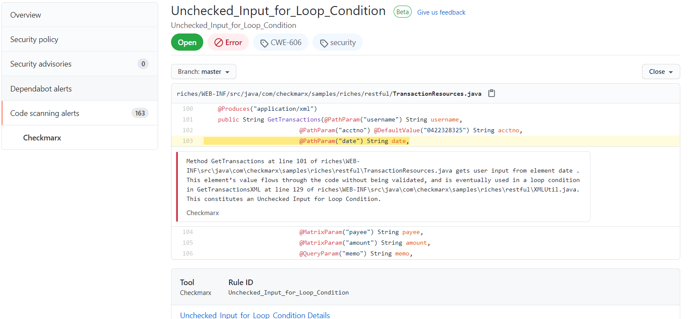
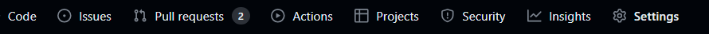
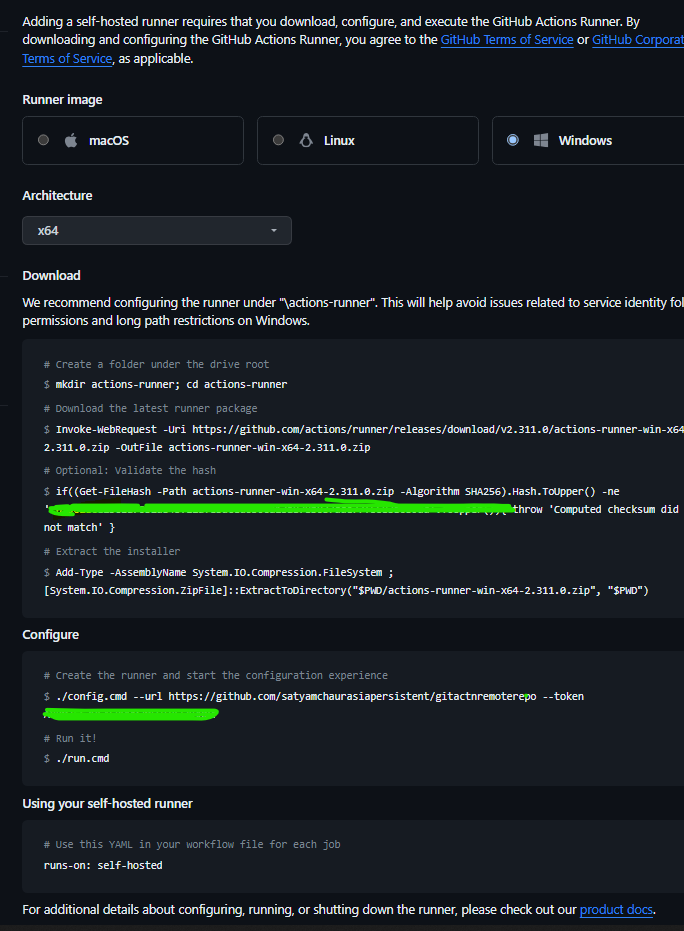

<br />

<div align="center">


[](https://www.gnu.org/licenses)
[](https://github.com/checkmarx-ts/checkmarx-cxflow-github-debian/releases)
[](https://github.com/checkmarx-ts/checkmarx-cxflow-github-debian/issues)

</div>
---
<br />
<p align="center">
  <a href="https://github.com/checkmarx-ts/checkmarx-cxflow-github-debian">
    
  </a>

<h3 align="center">Checkmarx CxFlow Github Action</h3>

<p align="center">
<br />
    <a href="https://github.com/checkmarx-ts/checkmarx-cxflow-github-debian/issues/new/choose">Report Bug</a>
    ·
    <a href="https://github.com/checkmarx-ts/checkmarx-cxflow-github-debian/issues/new/choose">Request Feature</a>
  </p>
</div>

## <a id="overview">Overview</a>

The **Checkmarx CxFlow GitHub Action** integrates [Checkmarx](https://www.checkmarx.com) SAST and SCA scanning directly into your GitHub workflows.  
It enables you to publish security alerts associated with your code using SARIF output for GitHub’s Code Scanning Alerts.

This GitHub Action serves as a wrapper around **CxFlow**, launching scans using the latest version through Docker for Checkmarx **SAST** or **SCA**.
> This action supports **Debian OS**.
>
> **Note:** For Alpine-based environments, please use the [checkmarx-cxflow-github-action](https://github.com/checkmarx-ts/checkmarx-cxflow-github-action).


---

## <a id="table-of-contents">Table of Contents</a>
1. [Overview](#overview)
2. [Features](#features)
3. [Version Compatibility](#version-compatibility)
4. [Inputs](#inputs)
5. [Secrets](#secrets)
6. [Filters](#filters)
7. [Params](#params)
8. [Outputs](#outputs)
9. [Sample Workflow files](#sample-workflow-files)
10. [Example Usage](#example-usage)
11. [Self-Hosted Runner Setup](#checkmarx-sastssca-using-self-hosted-environment)
12. [FAQ](#faq)
13. [How to Contribute](#how-to-contribute)
14. [License](#license)

---

## <a id="features">Features</a>

- **SAST (CxSAST)**: Enterprise-grade static analysis for identifying vulnerabilities in custom code early in the SDLC.
- **SCA (CxSCA)**: Next-gen Software Composition Analysis to detect open-source vulnerabilities and license issues.
- **CxFlow Orchestration**: Automates scan initiation, results management, and feedback integration into tools like GitHub and Jira.
- **SARIF Output**: Generates SARIF reports compatible with GitHub Code Scanning.
- **Multi-scanner Support**: Run SAST and SCA scans together.
- **Flexible Bug Tracking**: Integrate results with GitHub Issues, PR comments, or Jira tickets.

---

## <a id="version-compatibility">Version Compatibility</a>

The [latest release](https://github.com/checkmarx-ts/checkmarx-cxflow-github-debian/releases) of this GitHub Action is compatible with:

- **Checkmarx SAST:** v9.x
- **Checkmarx CxSCA**

---

## <a id="inputs">Inputs</a>

| Variable                | Example Value                                  | Description                                                                                                                                                                                                                                                        | Type    | Required | Default                        |
|-------------------------|------------------------------------------------|--------------------------------------------------------------------------------------------------------------------------------------------------------------------------------------------------------------------------------------------------------------------|---------|----------|--------------------------------|
| checkmarx_url           | https://checkmarx.company.com                  | Checkmarx Server URL                                                                                                                                                                                                                                               | String  | Yes      |                                |
| checkmarx_version       | 9.7                                            | Required for CxSAST version 9.5 and higher                                                                                                                                                                                                                         | String  | Yes      |                                |
| checkmarx_username      | ${{ secrets.CHECKMARX_USERNAME }}              | Checkmarx Username                                                                                                                                                                                                                                                 | String  | Yes      |                                |
| checkmarx_password      | ${{ secrets.CHECKMARX_PASSWORD }}              | Checkmarx Password                                                                                                                                                                                                                                                 | String  | Yes      |                                |
| checkmarx_client_secret | ${{ secrets.CHECKMARX_CLIENT_SECRET }}         | Checkmarx OIDC Client Secret  Reference [1](https://checkmarx.atlassian.net/wiki/spaces/KC/pages/1187774721/Using+the+CxSAST+REST+API+v8.6.0+and+up), [2](https://checkmarx.atlassian.net/wiki/spaces/KC/pages/1187774721/Using+the+CxSAST+REST+API+v8.6.0+and+up) | String  | Yes      |                                |
| team                    | /CxServer/SP/Company                           | Checkmarx Team for Project                                                                                                                                                                                                                                         | String  | No       | /CxServer/SP/Company           |
| project                 | Project-Name                                   | Checkmarx Project                                                                                                                                                                                                                                                  | String  | Yes      |                                |
| app                     | AppID-1234                                     | Unique Application Identifier used by downstream bug trackers (i.e. Jira)                                                                                                                                                                                          | String  | No       | SampleApp                      |
| preset                  | Checkmarx Default                              | Checkmarx scan preset (SAST)                                                                                                                                                                                                                                       | String  | No       | High and Medium                |
| break_build             | true                                           | Break build based on results?                                                                                                                                                                                                                                      | Boolean | No       | false                          |
| bug_tracker             | Sarif, GitHubPull, GitHub                      | Bug-tracker used for scan results                                                                                                                                                                                                                                  | String  | No       | Sarif                          |
| incremental             | true                                           | Trigger scan as incremental? (SAST)                                                                                                                                                                                                                                | Boolean | No       | true                           |
| github_token            | ${{ secrets.GITHUB_TOKEN }}                    | GitHub API Token, used for PR Feedback or GitHub Issue Feedback                                                                                                                                                                                                    | String  | No       | ${{ github.token }}            |
| repo-url                | ${{ github.event.repository.url }}             | GitHub Repository URL, used for Issue Feedback                                                                                                                                                                                                                     | String  | Yes      |                                |
| scanners                | SAST, sca                                      | Vulnerability Scanners (SAST, sca. Multiple comma separated values allowed.                                                                                                                                                                                        | String  | Yes      | None                           |
| extra_certificates      | certificates                                   | Workspace subdirectory containing additional CxFlow X509 certificates (.crt)                                                                                                                                                                                       | String  | No       | None                           |
| sca_api_url             | https://api-sca.checkmarx.net                  | API URL for SCA scan                                                                                                                                                                                                                                               | String  | No       | https://api-sca.checkmarx.net  |
| sca_app_url             | https://sca.checkmarx.net                      | APP URL for SCA scan                                                                                                                                                                                                                                               | String  | No       | https://sca.checkmarx.net      |
| sca_access_control_url  | https://platform.checkmarx.net                 | Access control URL for SCA scan                                                                                                                                                                                                                                    | String  | No       | https://platform.checkmarx.net |
| sca_tenant              | SCA-COMPANY_NAME                               | Tenant for the SCA project                                                                                                                                                                                                                                         | String  | No       |                                |
| sca_username            | ${{ secrets.SCA_USERNAME }}                    | Username for SCA scan                                                                                                                                                                                                                                              | String  | No       |                                |
| sca_password            | ${{ secrets.SCA_PASSWORD }}                    | Password for SCA scan                                                                                                                                                                                                                                              | String  | No       |                                |
| jira_url                | ${{ secrets.JIRA_URL }}                        | Jira Url                                                                                                                                                                                                                                                           | String  | No       |                                | 
| jira_username           | ${{ secrets.JIRA_USERNAME }}                   | Jira Username                                                                                                                                                                                                                                                      | String  | No       |                                |
| jira_token              | ${{ secrets.JIRA_TOKEN }}                      | Jira Secret. This is personal access token, not password.                                                                                                                                                                                                          | String  | No       |                                |
| jira_project            | ${{ secrets.JIRA_PROJECT }}                    | Jira Project Name                                                                                                                                                                                                                                                  | String  | No       |                                |
| jira_issue_type         | 'Application Security Bug'                     | Jira Issue Type                                                                                                                                                                                                                                                    | String  | No       |                                |
| jira_open_transition    | 'In Progress'                                  | Jira Open Transition Status                                                                                                                                                                                                                                        | String  | No       |                                |
| jira_close_transition   | 'Done'                                         | Jira Close Transition Status                                                                                                                                                                                                                                       | String  | No       |                                |
| jira_open_status        | 'Backlog,Selected for Development,In Progress' | Jira Open Status                                                                                                                                                                                                                                                   | String  | No       |                                |
| jira_closed_status      | 'Done'                                         | Jira Closed Status                                                                                                                                                                                                                                                 | String  | No       |                                |
| params                  | --severity=High --branch=${{ github.ref }}     | Any additional parameters for CxFlow.  For a full list of all the parameters, see the [following](https://github.com/checkmarx-ltd/cx-flow/wiki/Configuration).  Special note about [filtering](#Filters)                                                          | String  | No       |                                |
| java_opts               | -Xms512m                                       | Any Java options                                                                                                                                                                                                                                                   | String  | No       |                                |

*Note:* Please use `--checkmarx.settings-override=true` in params while using `project-custom-field` or `scan-custom-field`.
> 💡 **Note:**  
> Use `--checkmarx.settings-override=true` in `params` when using `project-custom-field` or `scan-custom-field`.

---

## <a id="secrets">Secrets</a>

It is recommended to store all sensitive data in GitHub Secrets.

| Secret                                                                                 | Description                  |
|----------------------------------------------------------------------------------------|------------------------------|
| `CHECKMARX_URL`, `CHECKMARX_USERNAME`, `CHECKMARX_PASSWORD`, `CHECKMARX_CLIENT_SECRET` | Checkmarx credentials        |
| `GITHUB_TOKEN`                                                                         | GitHub API token             |
| `SCA_USERNAME`, `SCA_PASSWORD`                                                         | SCA credentials              |
| `JIRA_URL`, `JIRA_USERNAME`, `JIRA_TOKEN`, `JIRA_PROJECT`                              | Jira integration credentials |

---

## <a id="filters">Filters</a>

Files can be excluded from the zip file that CxFlow uploads to CxSAST by adding the `--cx-flow.zip-exclude` parameter inside `params`.
The regular expression syntax is that used by the [`java.util.regex.Pattern`](https://docs.oracle.com/javase/8/docs/api/java/util/regex/Pattern.html) class.

**Example:**
```yaml
params: --cx-flow.zip-exclude=\.git/.*,\.github/.*,apps/tests/.*,apps/docs/.*,apps/web/.*
```

This will exclude all files and subdirectories found under the `.git`, `.github`, `apps/tests`, `apps/docs`, and `apps/web`.

> * Excluding the `.git` and `.github` folders from the zip file is highly important! Otherwise each commit will trigger a full scan due to changes in the files under these directories (which do not contain files that CxSAST will scan anyway).
> * Do not enclose the list of regular expressions in quotes as these will be taken to be part of the regular expression(s).

The CxFlow log will show you the regular expressions used:

```
2023-01-25 03:14:45.232  INFO 8 --- [           main] c.c.f.u.ZipUtils                          [vLhiqdlb] : Applying exclusions: \.git/.*,\\.github/.*
```

If DEBUG logging is enabled, each matching file will be logged:

```
2023-01-25 03:14:45.240 DEBUG 8 --- [           main] c.c.f.u.ZipUtils                          [vLhiqdlb] : match: \.git/.*$1.git/HEAD
2023-01-25 03:14:45.240 DEBUG 8 --- [           main] c.c.f.u.ZipUtils                          [vLhiqdlb] : match: \.git/.*$1.git/index
2023-01-25 03:14:45.241 DEBUG 8 --- [           main] c.c.f.u.ZipUtils                          [vLhiqdlb] : match: \.git/.*$1.git/config
...
```

---

## <a id="params">Params</a>

You can pass additional CxFlow CLI parameters via the `params` input. [Click here to know additional CLI parameters](https://github.com/checkmarx-ltd/cx-flow/wiki/Configuration)

**Example:**
```yaml
params: --sca.team ="/CxServer/Sca --jira.url ="https://xxxx.atlassian.net"
```

For environment variables with spaces, define them under `env` instead.

**Example:**
```yaml
env:
  JIRA_FIELDS_0_JIRA_FIELD_NAME: "Epic Link"
  JIRA_FIELDS_0_TYPE: static
```
> **Example Explanation**
>
>In given example as "Epic Link" contains space, hence it is used as environment variable and not passed in params.
>
>In the environment variable format, each parameter is represented by a unique variable name. The variable names are constructed by converting the YAML path to uppercase and replacing any dots with underscores The square brackets and their index are removed. The parameter key is separated from the value by an equal sign
>
>In the given example, the YAML parameter is transformed to the equivalent environment variable format. Each line represents a separate environment variable with its respective key-value pair.
>
>To understand more about environment variable, Please see [following](https://github.com/checkmarx-ltd/cx-flow/wiki/Configuration#env)


---

## <a id="outputs">Outputs</a>

The default output format is **SARIF**.  
CxFlow creates `./cx.sarif` containing filtered issue details.

Use it with [GitHub Code Scanning](https://docs.github.com/en/code-security/secure-coding/uploading-a-sarif-file-to-github).

**Upload Example:**
```yaml
# Upload SARIF report for CodeQL / Security Alerts Processing
- name: Upload SARIF file
  uses: github/codeql-action/upload-sarif@v2
  with:
    sarif_file: cx.sarif
```
**Sample Output (Security Alerts)**



---

## <a id="sample-workflow-files">Sample Workflow files</a>

* [Github PUSH workflow for SAST](sample-yml/checkmarx-sast-scan-push.yml)
* [Github PUSH workflow for SCA](sample-yml/checkmarx-sca-scan-push.yml)
* [Github PULL REQUEST workflow for SAST](sample-yml/github-pullrequest.yml)
* [Github Cloud Local scan](sample-yml/cloud_runner_local_scan.yml)
* [Github Cloud Remote scan](sample-yml/remote_sample.yml)

---

## <a id="example-usage">Example Usage</a>

### Full GitHub Workflow Example
```yaml
jobs:
  build:
    runs-on: ubuntu-latest
    permissions:
      contents: read
      issues: write
      pull-requests: write
      security-events: write
    steps:
      - uses: actions/checkout@v2
      - name: Checkmarx CxFlow Action
        uses: checkmarx-ts/checkmarx-cxflow-github-debian@v1.2
        env:
          JIRA_FIELDS_0_JIRA_FIELD_NAME: "Epic Link"
        with:
          project: ${{ github.repository }}-PR
          team: ${{ secrets.CHECKMARX_TEAMS }}
          checkmarx_url: ${{ secrets.CHECKMARX_URL }}
          checkmarx_username: ${{ secrets.CHECKMARX_USERNAME }}
          checkmarx_password: ${{ secrets.CHECKMARX_PASSWORD }}
          checkmarx_client_secret: ${{ secrets.CHECKMARX_CLIENT_SECRET }}
          scanners: sca
          break_build: true
          bug_tracker: jira
          params: '--namespace=${{ github.repository_owner }} --branch=${{ github.ref }} --logging.level.com.checkmarx.*=DEBUG'
```

---

## <a id="checkmarx-sastssca-using-self-hosted-environment">Checkmarx SAST/SCA Using Self-Hosted Environment</a>

### Setting up a GitHub Self-Hosted Runner

1. Go to **Project Settings → Actions → Runners**  
   
2. Select **New Self-hosted Runner**  
   
3. Choose your OS and follow the installation instructions  
   

---

### Example: Self-Hosted Runner (Local Scan)
```yaml
name: CxFlow
on:
  push:
    branches: [ $default-branch, $protected-branches ]
  pull_request:
    branches: [ $default-branch ]
jobs:
  build:
    runs-on: self-hosted
    permissions:
      contents: read
      issues: write
      pull-requests: write
      security-events: write
    steps:
      - uses: actions/checkout@v3
      - name: Checkmarx CxFlow Action
        uses: checkmarx-ts/checkmarx-cxflow-github-debian@v1.2
        with:
          project: ${{ secrets.CHECKMARX_PROJECT }}
          team: ${{ secrets.CHECKMARX_TEAMS }}
          checkmarx_url: ${{ secrets.CHECKMARX_URL }}
          checkmarx_username: ${{ secrets.CHECKMARX_USERNAME }}
          checkmarx_password: ${{ secrets.CHECKMARX_PASSWORD }}
          scanners: sast
          params: --namespace=${{ github.repository_owner }} --checkmarx.settings-override=true --repo-name=${{ github.event.repository.name }} --branch=${{ github.ref_name }}
      - name: Upload SARIF file
        uses: github/codeql-action/upload-sarif@v2
        with:
          sarif_file: cx.sarif
```

---

### Example: Self-Hosted Runner (Remote Scan)
```yaml
name: CxFlow
on:
  push:
    branches: [ $default-branch, $protected-branches ]
  pull_request:
    branches: [ $default-branch ]
jobs:
  build:
    runs-on: self-hosted
    permissions:
      contents: read
      issues: write
      pull-requests: write
      security-events: write
      actions: read
    steps:
      - uses: actions/checkout@v3
      - name: Checkmarx CxFlow Action
        uses: checkmarx-ts/checkmarx-cxflow-github-debian@v1.2
        with:
          project: ${{ secrets.CHECKMARX_PROJECT }}
          team: ${{ secrets.CHECKMARX_TEAMS }}
          checkmarx_url: ${{ secrets.CHECKMARX_URL }}
          checkmarx_username: ${{ secrets.CHECKMARX_USERNAME }}
          checkmarx_password: ${{ secrets.CHECKMARX_PASSWORD }}
          scanners: sast
          params: --github --namespace=${{ github.repository_owner }} --checkmarx.settings-override=true --repo-name=${{ github.event.repository.name }} --branch=${{ github.ref_name }}
      - name: Upload SARIF file
        uses: github/codeql-action/upload-sarif@v2
        with:
          sarif_file: cx.sarif
```

> **Note:** Ensure the working directory in logs matches the checkout location.

---

## <a id="faq">FAQ</a>

###  Why does a single file change trigger >7% code difference in SAST?
This occurs when `.git` and `.github` folders are not excluded.  
Use:
```yaml
env:
   CHECKMARX_CLIENT_ID : "resource_owner_sast_client"
   CHECKMARX_SCOPE : "access_control_api sast_api"
   CX_FLOW_ZIP_EXCLUDE: "\\.git/.*, \\\.github/.*"
```

---

## <a id="how-to-contribute">How to Contribute</a>

We appreciate feedback and contribution to the Github Action! Before you get started, please see the following:

- [Checkmarx contribution guidelines](docs/contributing.md)
- [Checkmarx Code of Conduct](docs/code_of_conduct.md)

## <a id="license">License</a>

This software is distributed under the [GNU GPL v3](https://www.gnu.org/licenses)  —  See `LICENSE` for more information.


Copyright © 2020 Checkmarx

